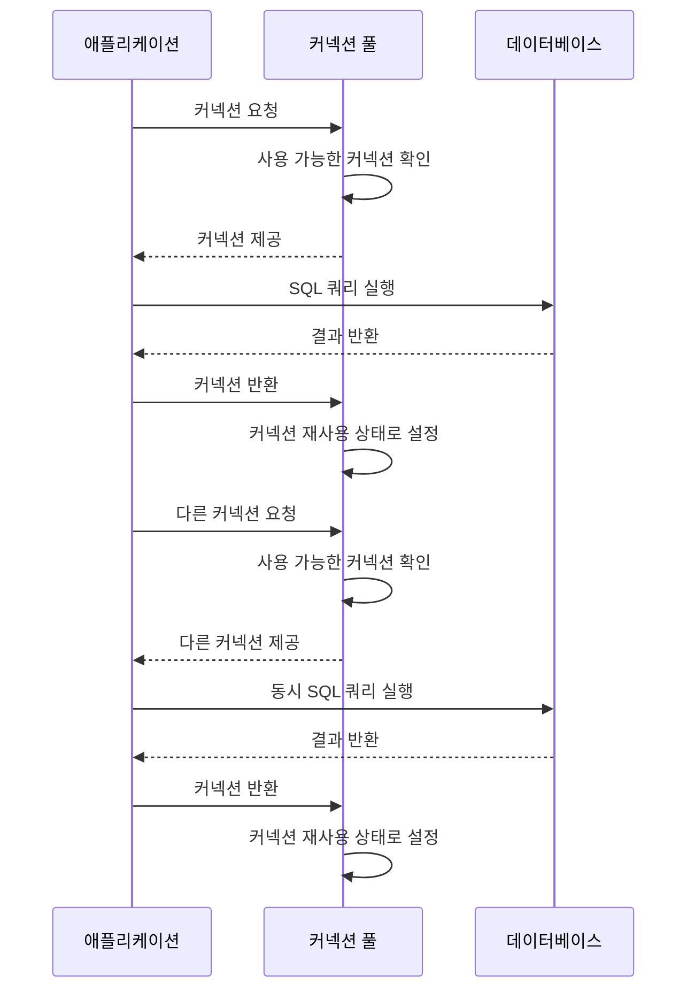

---
tags:
  - Database
  - ConnectionPool
  - HikariCP
aliases:
  - 커넥션 풀
  - 커넥션풀
  - HikariCP 설정
created: 2024-10-09
---

# Connection pool

[[DB Connection|커넥션]]에서 설명했듯이, 커넥션은 DB에서 매우 중요한 자원이며 이를 **효율적으로 관리하는 것**은 애플리케이션 성능에 큰 영향을 미친다. 

또한 [[DB Connection#^b425b7|커넥션 코드]]에서 언급한 것처럼, 매번 커넥션을 생성하고 끊는 작업은 매우 비효율적이며 성능 저하를 초래하므로, 현재는 **커넥션 풀(Connection Pool)** 개념을 사용하여 커넥션을 효율적으로 관리한다.

## 커넥션 풀이란?


**Connection Pool**은 직역하면 "커넥션의 수영장"이라는 의미로, 애플리케이션 실행 시 미리 일정량의 커넥션을 생성하여 커넥션 수립에 소요되는 시간을 줄이고, **커넥션을 재사용함**으로써 애플리케이션의 성능을 크게 향상시키는 구조이다.

Java 기반의 대표적인 커넥션 풀 구현체는 다음과 같다:

- **HikariCP** (Spring Boot 기본)
- **Apache Commons DBCP2**
- **Tomcat JDBC Connection Pool**
- **Oracle UCP**

## 커넥션 풀의 동작 구조



이러한 방식으로 커넥션 풀은 **여러 스레드의 동시 요청을 효율적으로 처리**할 수 있다.

---

## HikariCP

[HikariCP](https://github.com/brettwooldridge/HikariCP) 는 Spring Boot에서 기본으로 사용하는 커넥션 풀 구현체이며, 다음과 같은 특징을 갖는다

- 빠른 커넥션 생성/제거 속도
- 적은 메모리 소비
- 높은 안정성과 성능

### 커넥션 처리 흐름


1. 커넥션 요청 → 사용 가능한 커넥션이 있으면 즉시 반환
2. 사용 가능한 커넥션이 없고 최대 풀 사이즈 미만이면 → **새로운 커넥션 생성**
3. 최대 풀 사이즈 도달 시 → **반환까지 대기**, 대기 시간 초과 시 `SQLException` 발생

### 설정 예시

```yaml
hikari:  
  connection-timeout: 3000         # 커넥션을 얻기 위해 기다릴 최대 시간 (ms)
  maximum-pool-size: 15            # 커넥션 최대 개수 (기본값 10)
  max-lifetime: 30000              # 커넥션의 최대 수명 시간 (ms)
  minimumIdle: 10                  # 최소 유지 커넥션 개수
```

### 주요 설정 설명

- `connection-timeout`: 초과 시 예외 발생
- `maximum-pool-size`: 커넥션 수에 비례하여 동시 실행 가능한 쿼리 수가 늘어나지만, 하드웨어 자원도 더 많이 소모됨
- `max-lifetime`: 오래된 커넥션에 의한 리소스 누수 방지
- `minimumIdle`: 커넥션 풀이 항상 최소 이 수치만큼의 커넥션을 유지하도록 보장

### 적절한 maximum-pool-size 계산법

```txt
maxPoolSize = ((core_count * 2) + effective_spindle_count)
```

- `core_count`: CPU 코어 수
- `effective_spindle_count`: SSD 사용 시 일반적으로 1

무작정 커넥션 수를 늘리면 오히려 CPU, 메모리에 과부하를 주게 되며, 너무 적으면 커넥션 부족으로 대기가 발생하므로 **하드웨어와 트래픽을 기준으로 적절한 값을 설정**하는 것이 중요하다.

---

## 결론

- 커넥션 풀은 DB 자원을 효율적으로 관리하여 성능을 향상시키는 핵심 개념이다.
- Spring Boot에서 기본 제공하는 **HikariCP** 는 설정이 간단하면서도 매우 강력하다.
- `maximum-pool-size` 등 핵심 설정은 무턱대고 지정하기보다 **하드웨어 환경과 시스템 부하를 고려해 결정**해야 한다.

---

## 참고 자료

- [HikariCP 공식 GitHub](https://github.com/brettwooldridge/HikariCP)
- https://adjh54.tistory.com/73
- https://steady-coding.tistory.com/564
