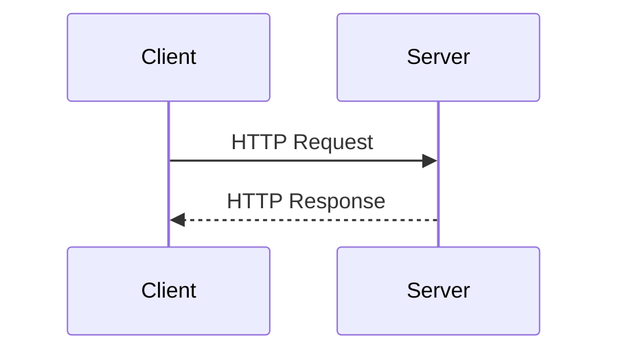

# 📘 HTTP (HyperText Transfer Protocol)

**HTTP**는 *HyperText Transfer Protocol*의 약자입니다.  
웹에서 클라이언트와 서버 간의 통신을 정의하는 대표적인 **규칙(Protocol)** 중 하나입니다.

HTTP는 **[[무상태 프로토콜 (Stateless)]]** 의 특성을 가지며, 각 요청(Request)은 서로 독립적으로 처리됩니다.

> [!note] 상태가 없는 통신이란?
> HTTP에서의 "상태"란 주로 **세션 정보**나 **연결의 맥락**을 의미합니다.  
> 예를 들어, 음식점에서 고객이 매번 주문할 때마다 원하는 음식, 조리 방법, 추가 요청 등을 반복해서 말해야 한다면, 이는 상태를 저장하지 않는 통신과 유사합니다.  
> 이전에 했던 요청에 대한 정보를 서버는 기억하지 못하며, 매번 새롭게 요청을 받아들입니다.

---

## HTTP의 역사 및 버전

HTTP는 발전을 거듭해 왔으며, 현재는 HTTP/3까지 공개된 상태입니다.  
가장 많이 사용되는 버전은 **HTTP/1.1**이며, **HTTP/2**, **HTTP/3**의 사용 비율도 점차 증가하는 추세입니다.

아래는 주요 버전별 특징입니다:

| 버전       | 연도   | 주요 특징                                       |
| -------- | ---- | ------------------------------------------- |
| HTTP/0.9 | 1991 | GET 메서드만 지원, 헤더 없음                          |
| HTTP/1.0 | 1996 | 다양한 메서드 및 헤더 추가                             |
| HTTP/1.1 | 1997 | 가장 널리 사용됨. RFC2068 → RFC2616 → RFC7230~7235 |
| HTTP/2   | 2015 | 성능 개선 (멀티플렉싱, 헤더 압축 등)                      |
| HTTP/3   | 진행 중 | TCP 대신 [[UDP]] 기반, 더 빠른 연결 설정 가능            |

현재 사용 중인 HTTP 버전은 브라우저의 개발자 도구 (네트워크 탭)를 통해 확인할 수 있습니다.

---

## 기반 전송 프로토콜

HTTP는 아래와 같은 전송 프로토콜 위에서 동작합니다:

- **[[TCP]] 기반**  
  - HTTP/1.1, HTTP/2는 TCP 기반에서 동작합니다.
- **[[UDP]] 기반**  
  - HTTP/3는 TCP 대신 UDP 위에서 동작하며, 성능 개선을 목표로 개발되고 있습니다.
