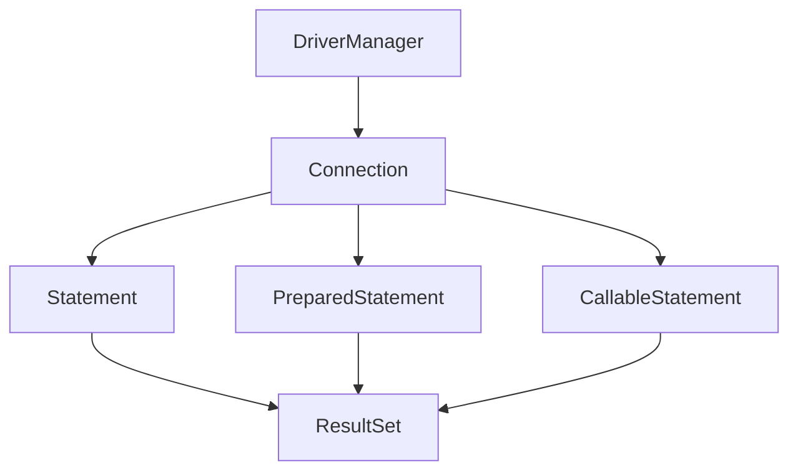

---
tags:
  - 개발
  - 기술정리
  - JDBC
aliases:
  - Java Database Connectivity
  - JDBC 구조
  - JDBC 실습
created: 2025-05-18
type: 기술정리
---

# 📘 JDBC

**JDBC**는 *Java DataBase Connectivity*의 약자로, 자바 애플리케이션에서 데이터베이스에 연결하고 SQL을 실행하기 위해 사용되는 표준 API입니다.

Java에서는 DB와 쉽게 연결할 수 있도록 `java.sql`이라는 인터페이스 기반의 모듈을 제공합니다.  
→ [공식 문서 링크](https://docs.oracle.com/en/java/javase/11/docs/api/java.sql/module-summary.html)

각 [[DBMS]] 업체들은 이 인터페이스를 구현한 **JDBC Driver**를 제공하며, 우리는 이 드라이버를 설치함으로써 자바 코드에서 DB와 통신할 수 있습니다.

---

## 🔧 JDBC 클래스 구조

아래는 JDBC 주요 클래스들 간의 관계를 머메이드 다이어그램으로 나타낸 것입니다.



---

## 🔍 주요 인터페이스 및 클래스 설명

1. **DriverManager**  
   - JDBC 드라이버를 관리하고, 데이터베이스와의 [[Connection]] 객체를 생성하는 역할을 합니다.

2. **Connection**  
   - 데이터베이스와의 실제 연결을 나타내는 객체입니다.  
   - SQL 실행을 위한 `Statement`, `PreparedStatement`, `CallableStatement` 객체를 생성할 수 있습니다.

3. **Statement, PreparedStatement, CallableStatement**  
   - SQL 문을 실행하기 위한 객체들입니다.
     - `Statement`: 정적 SQL 실행에 사용됩니다.
     - `PreparedStatement`: 파라미터가 포함된 동적 SQL 실행에 사용됩니다. [[SQL Injection]] 방지에 효과적입니다.
     - `CallableStatement`: [[Stored Procedure|저장 프로시저]]를 호출할 때 사용됩니다.

4. **ResultSet**  
   - SQL 실행 결과로 반환되는 데이터의 집합을 표현하는 객체입니다.
   - `ResultSet`을 통해 질의 결과 데이터를 한 행씩 탐색하며 처리할 수 있습니다.

---

## 🧪 JDBC 실습 예제

다음은 JDBC를 이용하여 MySQL에 연결하고 데이터를 조회하는 기본 실습 예제입니다.

```java
public class Main {
    public static void main(String[] args) {
        String url = "jdbc:mysql://localhost:3390/mydatabase";
        String user = "myuser";
        String password = "mypassword";
        try {
            // 1. 드라이버 로딩
            Class.forName("com.mysql.cj.jdbc.Driver");
            
            // 2. DB 연결
            Connection conn = DriverManager.getConnection(url, user, password);
            
            // 3. Statement 생성 및 SQL 실행
            Statement stmt = conn.createStatement();
            ResultSet rs = stmt.executeQuery("SELECT * FROM Posts");
            
            // 4. 결과 출력
            // "title" 은 ResultSet 에 담긴 컬럼 명 을 의미 한다.
            while (rs.next()) {
                System.out.println(rs.getString("title"));
            }
            
            // 5. 자원 해제
            rs.close();
            stmt.close();
            conn.close();
        } catch (Exception e) {
            e.printStackTrace();
        }
    }
}
```

### 실행 흐름 요약

1. `Class.forName`  
   → 사용할 JDBC 드라이버를 `DriverManager`에 등록합니다.

2. `DriverManager.getConnection(...)`  
   → 접속 정보(URL, 사용자명, 비밀번호)를 바탕으로 DB 연결을 수행합니다.

3. `createStatement()`  
   → SQL을 실행할 수 있는 Statement 객체를 생성합니다.

4. `executeQuery(...)`  
   → SELECT 쿼리를 실행하고 결과를 `ResultSet`으로 반환받습니다.

5. `ResultSet.next()`  
   → 반복을 통해 결과 행을 하나씩 탐색하며 출력합니다.

6. `close()`  
   → 자원(커넥션, Statement, ResultSet)을 명시적으로 해제합니다.

---

## 📌 참고 사항

- 이 실습은 순수 Java 기반의 JDBC 접근 방식입니다.
- Spring 환경에서는 HikariCP 같은 커넥션 풀이 자동으로 커넥션을 관리합니다.
- 현재는 [[MyBatis]] 또는 JPA 와 같은 프레임워크를 사용하여 SQL을 추상화하는 방식이 더 일반적입니다.

📂 예제 코드: [GitHub - BoardDAO.java](https://github.com/JoungDongHee/JoungDongHee/blob/master/Project/src/DAO/BoardDAO.java)
