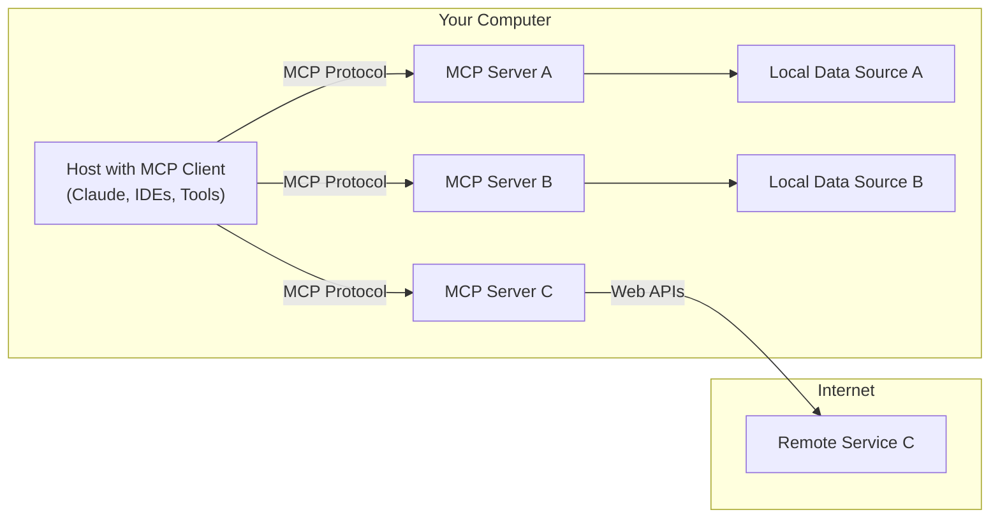

---
tags:
  - 개발
  - 기술정리
  - "#개발"
  - "#기술정리"
  - "#MCP"
  - "#AI"
  - "#개방형프로토콜"
  - "#API"
  - "#LLM컨텍스트표준화"
created: 2025-05-07
type: 기술정리
aliases:
  - LLM 컨텍스트 표준화
  - 개방형 프로토콜
  - MCP 아키텍처
  - USB-C LLM
  - MCP 카카오톡 API
  - MCP
  - mcp
  - Mcp
---

# 📘 Model Context Protocol

[Anthropic](https://docs.anthropic.com/ko/docs/agents-and-tools/mcp) 이 2024년 11월에 발표한 **Model Context Protocol**, 줄여서 **MCP**는 **애플리케이션이 LLM에 컨텍스트를 제공하는 방식을 표준화**한 **개방형 프로토콜**입니다.

단순하게 설명하면, **USB-C 포트와 같은 개념**입니다.  
USB-C는 하나의 규격으로 **충전**, **데이터 전송**, **디스플레이 출력** 등 여러 기능을 통합했듯, MCP도 다양한 **데이터 소스와 도구를 LLM에 연결하기 위한 표준화된 인터페이스**를 제공합니다.

이를 통해 기존처럼 개별 플러그인이나 커스텀 코드를 작성할 필요 없이, **모델이 일관된 방식으로 도구나 데이터에 접근할 수 있게** 해 줍니다.

---

## 🧠 MCP 아키텍처



### MCP 구성 요소

- **MCP 호스트**: MCP를 통해 데이터에 접근하려는 주체. (클로드, 챗GPT, IDEs 등)
- **MCP 클라이언트**: 호스트 안에서 서버와 1:1 연결을 유지. 서버에 ‘요청’을 함.
- **MCP 서버**: 클라이언트의 요청을 받아서 정보를 제공하거나 동작을 실행함. (구글 드라이브, 슬랙, 깃헙 등)

## 🕰️ MCP 등장 전후 비교

### MCP 등장 전의 문제점

과거에는 예를 들어 **카카오톡** API를 활용하고자 할 경우,

- 해당 서비스의 API 문서를 탐색하고
- 인증 키 발급 및 설정
- 요청 형식에 맞는 커스텀 코드 작성  등의 과정이 필요했습니다.

이는 서비스마다 모두 달라서, 매번 **새로운 구현과정**이 필요했습니다.

### 🚀 MCP 도입 효과

MCP가 등장한 후에는 단순히 **MCP 서버를 설치**하고,  **도구 이름**과 **파라미터만 명시**하면 됩니다.

```JSON
{
  "tool_name": "mcp_kakao_map_search_places",
  "parameters": {
    "keyword": "판교역 현대백화점"
  }
}
```
이렇게 요청하면 MCP 서버가 내부적으로 **카카오 API를 호출**하여 결과를 반환합니다.  
더 이상 개별 서비스마다 고유한 설정을 구현할 필요가 없습니다.

[KAKAO MCP Server](!https://github.com/jeong-sik/kakao-api-mcp-server)
