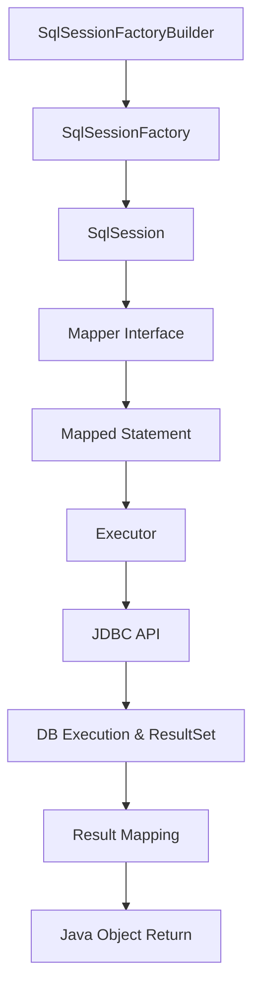

---
tags:
  - MyBatis
  - Java
  - 기술정리
  - Mapper
  - ORM
aliases:
  - 마이바티스
  - MyBatis 핵심
  - Mapper 사용법
  - SqlSession 흐름
  - mybatis-config
created: 2025-05-21
type: 기술정리
---

# 🧩 MyBatis 핵심 정리 및 예제

**MyBatis** 는 [[JDBC]]의 반복 작업(연결, 바인딩, 결과 매핑 등)을 자동화하고, SQL을 명시적으로 제어할 수 있게 해주는 **경량 ORM 프레임워크**입니다. 

XML 또는 어노테이션으로 SQL을 정의하고, 이를 Java 객체와 자동 매핑합니다.

---

## 🔄 MyBatis 처리 흐름



### 구성 요소 요약

| 구성 요소              | 역할 설명 |
|------------------------|-----------|
| `SqlSessionFactoryBuilder` | 설정 XML을 읽고 SqlSessionFactory 생성 |
| `SqlSessionFactory`    | DB 설정 관리, 앱 시작 시 1회 생성 후 공유 |
| `SqlSession`           | SQL 실행 및 트랜잭션 단위, close 필수 |
| `Mapper Interface`     | Java 메서드 선언, 실제 SQL은 XML에 작성 |
| `Mapped Statement`     | XML 내 SQL 매핑 정보 (`<select>`, `<insert>` 등) |
| `Executor`             | SQL 실행 처리기 (Simple, Batch 등) |
| `Result Mapping`       | ResultSet → Java 객체 매핑 |
| `Java Object`          | 최종 반환 객체 (DTO/도메인 등) |

---

## 🗂️ 설정 및 예제 파일

### 📄 mybatis-config.xml

```xml
<configuration>
  <environments default="dev">
    <environment id="dev">
      <transactionManager type="JDBC"/>
      <dataSource type="POOLED">
        <property name="driver" value="com.mysql.cj.jdbc.Driver"/>
        <property name="url" value="jdbc:mysql://localhost:3306/test"/>
        <property name="username" value="root"/>
        <property name="password" value="1234"/>
      </dataSource>
    </environment>
  </environments>
  <mappers>
    <mapper resource="mapper/UserMapper.xml"/>
  </mappers>
</configuration>
```

### 📄 UserMapper.xml

```xml
<mapper namespace="com.example.mapper.UserMapper">
  <select id="selectUser" parameterType="int" resultType="User">
    SELECT * FROM users WHERE id = #{id}
  </select>
</mapper>
```

### 📄 Mapper Interface

```java
public interface UserMapper {
    User selectUser(int id);
}
```

### 📄 실행 코드

```java
String resource = "mybatis-config.xml";
InputStream inputStream = Resources.getResourceAsStream(resource);
SqlSessionFactory factory = new SqlSessionFactoryBuilder().build(inputStream);
try (SqlSession session = factory.openSession(true)) {
    UserMapper mapper = session.getMapper(UserMapper.class);
    User user = mapper.selectUser(1);
    System.out.println(user.getName());
}
```

---

## 📌 parameterType vs resultType

| 항목 | 설명 |
|------|------|
| `parameterType` | 쿼리에 전달할 **입력값 타입** (`int`, `String`, DTO 등) |
| `resultType` | 쿼리 결과를 바인딩할 **출력 객체 타입** (`User`, `Map` 등) |

> ⚠️ 주의: parameterType에는 getter가, resultType에는 setter가 반드시 필요합니다.

복잡한 결과 매핑이 필요한 경우 `resultMap` 사용을 권장합니다.

---

## 🛡️ SQL Injection 방지

MyBatis는 `#{} 바인딩`을 통해 자동으로 `PreparedStatement`를 생성하여 SQL Injection을 방지합니다.

```xml
<select id="loginUser" parameterType="map" resultType="User">
  SELECT * FROM users WHERE username = #{username} AND password = #{password}
</select>
```

- `#{} 사용`: 안전 (PreparedStatement)
- `${}` 사용: SQL Injection 위험 (단순 치환)

---

## ⚠️ 개발 시 주의사항

- `${}`는 절대 사용하지 말 것
- `parameterType` 객체는 getter 필요
- `resultType` 객체는 setter 필요
- 메서드명과 XML의 id가 일치해야 함
- 반환값이 복잡할 경우 `resultMap`으로 명시적 매핑

---

## 🧠 추가 팁

- 트랜잭션은 `SqlSession` 단위로 관리되며, Spring에서는 `@Transactional` 사용
- 동적 SQL 구문 (`if`, `choose`, `foreach`) 지원
- `Mapper Interface`는 실제 구현체 없이 MyBatis가 런타임에 동적 생성

---

## 🔗 관련 문서
- [[SQL Injection]]
- [[Spring JDBC]]
- [[JPA vs MyBatis]]
- [[@Transactional]]
