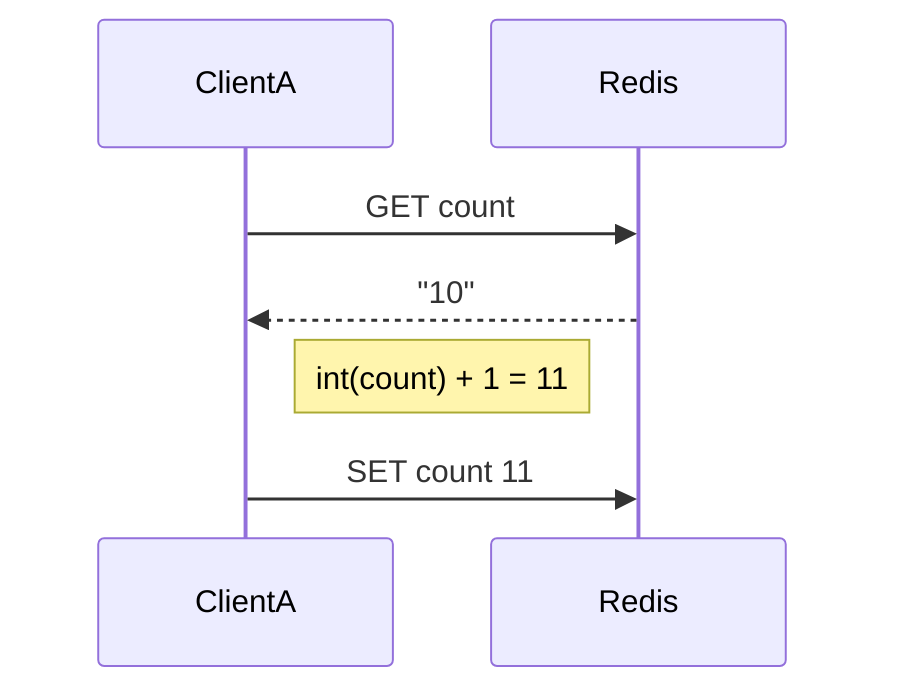

---
tags:
  - Redis
  - 동시성
  - 기술정리
  - 분산락
created: 2025-05-12
type: 기술정리
aliases:
  - Redis 동시성
  - Redis 레이스컨디션
  - Redis 분산락
  - Redis 트랜잭션 문제
---

# 🚦 Redis의 동시성 문제와 원자성 정리

Redis는 싱글 스레드 기반의 이벤트 루프 구조를 가지므로, 일반적인 의미의 동시성 문제는 거의 없습니다.  
그러나 **명령어 조합 방식이나 클라이언트 처리 방식**에 따라 간접적인 동시성 문제가 발생할 수 있습니다.

---

## ✅ Redis의 동시성 처리 구조

### 🔹 단일 스레드, 이벤트 루프 기반
- Redis는 **모든 명령어를 순차적으로 처리**합니다.
- 기본적으로 각 명령어는 **원자적으로 실행**됩니다.

> 예: `INCR`, `SET`, `DEL` 등은 중간에 끼어들 수 없고 단일 연산으로 처리됩니다.

---

## ⚠️ Redis에서 동시성 문제가 발생하는 경우

### 1. GET → 처리 → SET 구조

```python
# 위험한 예시
val = redis.get("count")
val = int(val) + 1
redis.set("count", val)
```

- 이 방식은 **두 개의 명령어 사이에 다른 클라이언트가 개입**할 수 있어,  
  **레이스 컨디션**이 발생할 수 있습니다.



> ⚠ 이 과정 중 다른 클라이언트가 `count` 값을 수정할 수 있음 → 동시성 이슈 발생

**해결 방법**: 아래처럼 `INCR` 사용

```shell
INCR count
```

---

### 2. 여러 명령어 조합 처리

```shell
GET key1
GET key2
SET summary ...
```

- 각각의 명령어가 독립 실행되므로 **명령어 사이에 간섭이 발생할 수 있음**

---

### 3. MULTI/EXEC 트랜잭션의 한계

- Redis의 트랜잭션은 **롤백을 지원하지 않음**
- `WATCH` 없이 사용할 경우, 실행 직전까지 **외부 변경에 노출**

```shell
WATCH balance
MULTI
DECR balance
EXEC
```

---

## 🔐 동시성 문제 방지를 위한 기능

| 기능                  | 설명              |
| ------------------- | --------------- |
| `INCR`, `DECR`      | 원자적 숫자 연산       |
| `MULTI`, `EXEC`     | 트랜잭션 처리         |
| `WATCH`             | 낙관적 락 처리        |
| `SET key val NX PX` | 분산 락 처리 가능      |
| [[RedLock]]         | Redis 분산 락 알고리즘 |

---

## 📌 요약 정리

| 항목    | 설명                           |
| ----- | ---------------------------- |
| 구조    | 단일 스레드, 단일 명령어는 원자성 보장       |
| 위험 요소 | 여러 명령어 조합 처리                 |
| 해결책   | 원자 명령어, 트랜잭션 + WATCH, 분산락 사용 |

---

## 📚 관련 문서

- [[Redis 트랜잭션과 WATCH]]
- [[RedLock 알고리즘]]
- [[Redis 성능 최적화 기법]]
