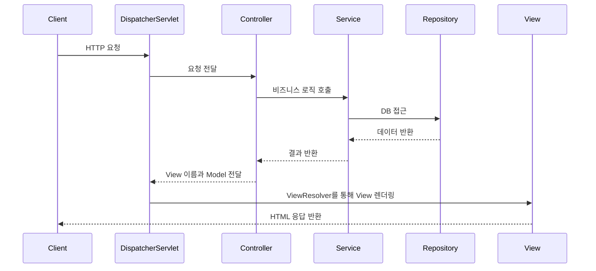

# Spring MVC

**Spring MVC**는 [[MVC 패턴]]을 기반으로 한 Spring Framework의 웹 애플리케이션 아키텍처입니다. 요청과 응답을 DispatcherServlet이 중앙에서 처리하며, 개발자는 각 계층(Model, View, Controller)에 집중할 수 있게 도와주는 프레임워크입니다.

---

## 구성 요소

| 구성 요소 | 설명 |
|-----------|------|
| **DispatcherServlet** | 모든 HTTP 요청의 진입점으로, Controller로 요청을 전달 |
| **Controller** | 사용자의 요청을 받아 처리하고 결과 데이터를 반환 (`@Controller`, `@RestController`) |
| **Service** | 비즈니스 로직을 담당하며 Controller와 Model 사이에서 처리 역할 |
| **Model** | 애플리케이션의 데이터와 상태를 표현 |
| **View** | 데이터를 사용자에게 보여주는 역할 (Thymeleaf, JSP 등) |
| **ViewResolver** | 논리적인 View 이름을 실제 View로 변환 |

---

## 동작 흐름

---

## 특징

- **어노테이션 기반 구성** (`@Controller`, `@GetMapping`, `@RequestParam` 등)
- **전통적인 JSP 뿐만 아니라 다양한 템플릿 엔진 지원** (Thymeleaf, Mustache 등)
- **Validator, ExceptionHandler, AOP 등과의 유기적인 통합**
- **RESTful API 설계에 적합한 구조 제공 (`@RestController`)**

---

## 일반 MVC와의 차이점

- **DispatcherServlet**을 통한 요청 분배
- 어노테이션 기반의 라우팅 및 DI 지원
- Controller와 View 분리를 넘어, Service, Repository 계층의 명확한 역할 구분
- 테스트, 유지보수, 확장성 측면에서 훨씬 강력한 지원

> 일반 MVC와의 상세 비교는 [[MVC 패턴]] 문서를 참고하세요.

---

## 함께 보면 좋은 문서

- [[MVC 패턴]]
- [[Spring Boot]]
- [[3계층 아키텍처]]
