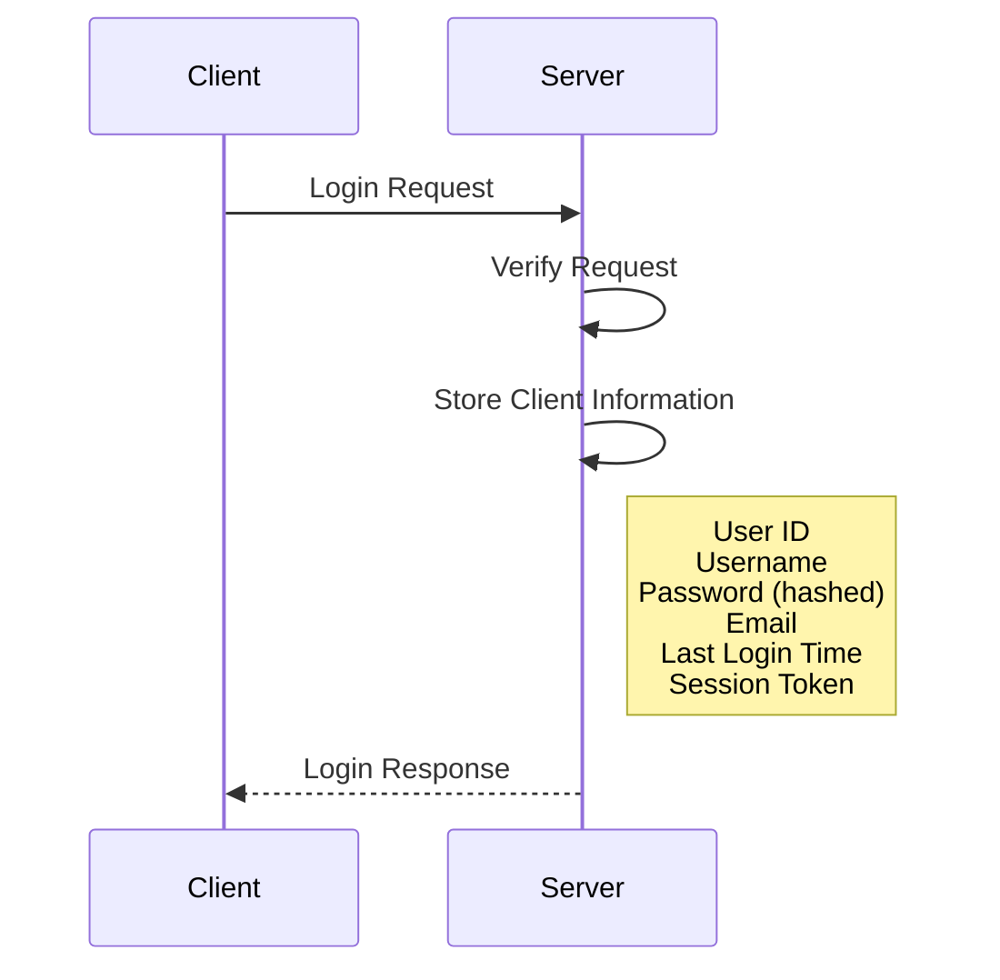
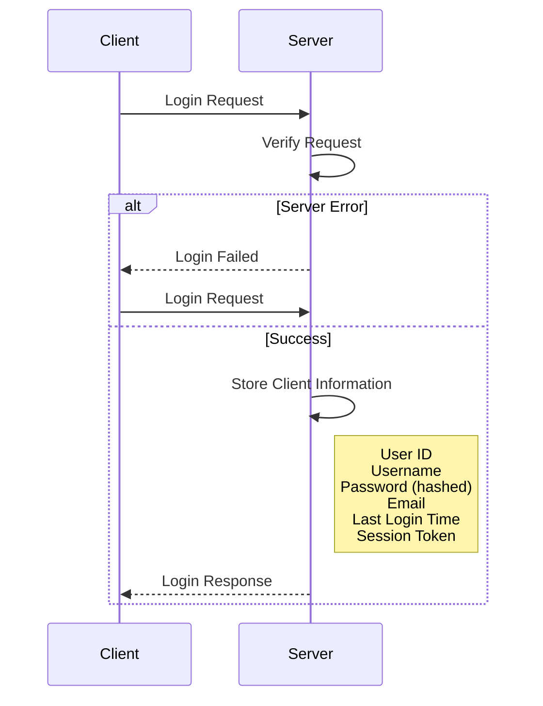

# 📘상태유지 프로토콜 (Stateful Protocol)

**상태유지 프로토콜(Stateful Protocol)** 은 [[무상태 프로토콜 (Stateless)]]과는 반대 개념으로,  
**서버가 클라이언트의 상태 정보를 보존**하는 통신 방식입니다.

이 방식에서는 클라이언트가 서버에 요청을 보낸 후, 서버가 해당 클라이언트의 상태(세션 등)를 저장하고 이를 바탕으로 이후 요청을 처리합니다.

---

## 예시: TCP 통신

가장 대표적인 상태유지 프로토콜은 **[[TCP]] 통신**입니다.  
TCP는 **3-way Handshake** 과정을 통해 연결을 설정하고, 상태를 유지한 채 데이터를 주고받습니다.

---

## 상태유지 프로토콜의 동작 예시

아래는 로그인 절차에 따른 상태 유지 예시입니다:

---

## 단점: 장애 및 확장성의 한계

Stateful 프로토콜의 대표적인 단점은 다음과 같습니다:

1. **장애 발생 시 상태 손실**
    - 서버가 재시작되거나 교체되는 경우, 이전 클라이언트의 상태 정보는 소실됩니다.
    - 예: 로그인이 되어 있던 상태에서도 서버 오류가 발생하면, 다시 로그인을 요청해야 함

2. **수평 확장(Scaling)의 한계**
    - 사용자 수가 증가할수록 세션 정보를 관리하는 부담도 커지며, 서버 개수를 늘리는 것만으로는 한계가 발생할 수 있습니다.
    - 상태를 공유해야 하므로 로드 밸런서나 외부 세션 저장소(Redis 등)를 함께 사용해야 합니다.

---

## 요약

| 항목     | Stateless                               | Stateful           |
| ------ | --------------------------------------- | ------------------ |
| 상태 유지  | ❌ (요청마다 독립적)                            | ✅ (상태 저장 및 재사용 가능) |
| 예시     | [[HTTP]] | [[TCP]]            |
| 확장성    | 뛰어남                                     | 제한적                |
| 복구 용이성 | 상대적으로 쉬움                                | 장애 시 복구 어려움        |

---
